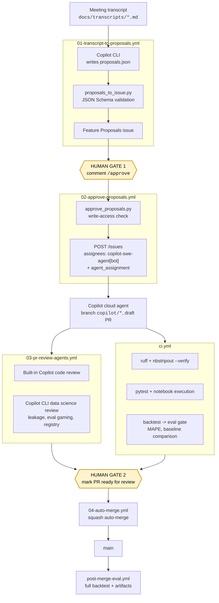

# Architecture

## The pipeline



Two human gates, both deliberate:

1. **`/approve` on the proposals issue.** Nothing reaches the coding agent without a
   person with write access saying so. This is where you drop the proposals the
   agent should not have made.
2. **Marking the draft pull request ready for review.** The Copilot coding agent
   cannot do this itself, cannot approve, and cannot merge, so this gate is free.
   The reviews and CI results are already on the pull request when you make the call.

## Why the agent only ever writes JSON

Every agent step in this repo has the same shape:

```
agent  ->  a file on disk  ->  deterministic Python  ->  a GitHub API call
```

The transcript agent does not open the issue. It writes `proposals.json`, and
`scripts/proposals_to_issue.py` validates that against
`.github/agent-prompts/proposals.schema.json` before rendering anything. A model
that returns prose, truncated JSON, or a plausible-looking object with a missing
field fails at the schema boundary with a message that names the field, and the
raw output is uploaded as an artifact.

The alternative, parsing model output directly in a workflow step, produces
malformed issues that look fine until someone reads them.

The same principle applies to the approval hop. `scripts/approve_proposals.py`
holds the permission check, the `/approve` grammar, and the issue rendering; the
workflow YAML just calls it. That is why the logic has 100+ unit tests and the
YAML has almost none.

## Passing state between workflows

The approval workflow needs the structured proposals, but all it receives is an
`issue_comment` webhook. Rather than re-run the agent or scrape the rendered
markdown, the proposals issue carries its own machine-readable copy:

````markdown
<!-- BEGIN_PROPOSALS_JSON -->
<details>
<summary>Machine-readable proposal data</summary>

```json
{ "source_transcript": "...", "proposals": [ ... ] }
```

</details>
<!-- END_PROPOSALS_JSON -->
````

`embed_payload` writes it, `parse_embedded_payload` recovers it. Collapsed in a
`<details>` block so it does not dominate the issue, and byte-exact so the
approval step operates on precisely what the human read.

## Tokens

| Token | Used by | Why |
|---|---|---|
| `AGENT_PAT` | every agentic workflow | See below |
| `GITHUB_TOKEN` | `ci.yml`, `post-merge-eval.yml` | No cross-workflow triggering needed |

`AGENT_PAT` is a fine-grained personal access token and it is not optional in
three separate places:

1. **Copilot CLI** reads `COPILOT_GITHUB_TOKEN` first and needs the account-level
   *Copilot Requests* permission. Classic `ghp_` tokens are not supported.
2. **Assigning the coding agent** goes through an endpoint that rejects
   server-to-server tokens. The default `GITHUB_TOKEN` is a server-to-server
   token, so it cannot start an agent session at all.
3. **The recursion guard.** Events created with `GITHUB_TOKEN` do not trigger new
   workflow runs. That protection is correct in general, but here the whole point
   is a chain: the issue created in step 2 has to be visible to the agent, and the
   pull request the agent opens has to trigger review and CI.

## The product being built

A demand forecasting project, so CI has something real to gate on.

```
src/forecasting/
  data.py        loading, SKU selection, rolling-origin splits
  features.py    calendar, lag and rolling features, all shifted
  models/        Forecaster protocol, seasonal naive, SARIMAX
  registry.py    name -> factory. New models are a one-line addition
  evaluate.py    MAE / RMSE / MAPE / sMAPE / bias, rolling-origin backtest
```

`registry.py` is the extension point on purpose. "Add a Prophet model" becomes a
new file plus one registry entry, which is a change a coding agent can make well
and a reviewer can check quickly.

The eval gate (`eval/thresholds.yml`, enforced by `scripts/check_eval_gate.py`)
is what makes the demo more than a lint check. A pull request that adds a model
which forecasts worse fails CI on the numbers.

## Three gaps left open on purpose

The transcript asks for exactly these, and none of them exist yet:

| Gap | Where it would land |
|---|---|
| No Prophet model | `src/forecasting/models/`, registered in `registry.py`. The optional `prophet` extra is already declared in `pyproject.toml`. |
| No holiday or promotion features | `src/forecasting/features.py`. The `on_promotion` and `price` columns are in `data/raw/sales.csv` and nothing reads them. |
| No per-SKU evaluation | `scripts/run_backtest.py` evaluates the `TOTAL` aggregate only. |

So the demo builds real, missing functionality rather than a contrived task.

## Failure modes and how they are handled

| Failure | Behaviour |
|---|---|
| Agent returns prose instead of JSON | Schema validation fails, run fails, raw output uploaded as an artifact, no issue created |
| Agent invents a field or drops one | Same, with the JSON path named in the error |
| A user without write access comments `/approve` | Permission check fails before anything is created |
| Permission check itself errors | Treated as denial, not as success |
| Proposals issue body was hand-edited | Payload recovery fails with an explicit message |
| `/approve 9` on a 3-proposal issue | Rejected with the valid range, nothing created |
| Copilot's pull request holds Actions in approval-required state | Scheduled sweeper in `03-pr-review-agents.yml` picks it up within 30 minutes |
| Data science reviewer produces nothing | A placeholder comment links the run; the pull request is not blocked |
| Checks fail on an agent pull request | `needs-human-review` label applied, auto-merge not enabled |
